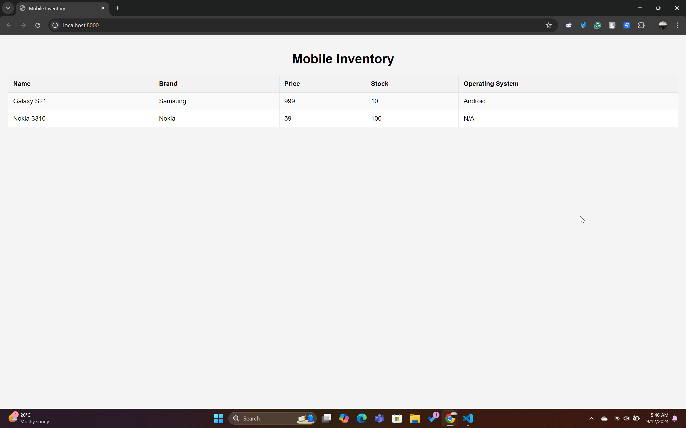

# Section 1 - Introduction

### What is a Framework?

A framework provides a structured environment for developers to build and organize their applications. Here's a comparison between libraries and frameworks:

| Aspect | Library | Framework |
| --- | --- | --- |
| **Definition** | A collection of pre-written code that you can call to perform common tasks. | A comprehensive platform that provides a structure for your application and dictates the architecture. |
| **Control Inversion** | The developer calls the library code. | The framework calls the developer's code. |
| **Flexibility** | Offers more flexibility; you can pick and choose what to use. | More rigid; you must follow the framework's rules and conventions. |
| **Usage** | Used to perform specific tasks within your code. | Provides a complete solution and organizes your code. |
| **Learning Curve** | Generally easier to learn as it focuses on specific tasks. | Often has a steeper learning curve due to its comprehensive nature. |
| **Examples** | jQuery, NumPy, React (as a library) | Angular, Django, Ruby on Rails |
| **Dependency** | Can be used alongside other libraries without much conflict. | Often requires you to fully commit to the framework, which may limit the use of other tools. |
| **Scope** | Narrower scope, focusing on specific functionalities. | Broader scope, encompassing architecture, flow, and more. |

### What is Laravel?

**Laravel** is a web application framework designed with expressive, elegant syntax. It simplifies common tasks like routing, sessions, and authentication, enabling developers to focus more on building their application without worrying about the foundational setup. Laravel uses the **MVC (Model-View-Controller)** architecture, which separates the application logic from the user interface, making the code more organized and maintainable.


### Why Laravel?

- **Popular**: Laravel is widely used and has a large community, making it easier to find resources and support.
- **Easy to use**: With its simple, intuitive syntax, Laravel is beginner-friendly.
- **Batteries included**: Laravel comes with built-in features to handle common tasks like:
  - Logging
  - Sessions
  - Notifications

---

### Refresher Task: OOP & PHP

As part of this section, there’s a refresher task for practicing Object-Oriented Programming (OOP) concepts in PHP. The task is available on GitHub: [Refresher OOP & PHP](https://github.com/dptsi/laravel-tutorial).

#### Task Requirements:
- **Create a Class for Mobile Phones**:  
  Design a class representing a mobile phone with attributes like `name`, `brand`, `price`, and `stockQuantity`.
  
- **Main Operations**:  
  Create a main class to handle inventory, including methods to add, delete, and update mobile phone data.
  
- **Apply Basic OOP Concepts**:  
  Use **Abstraction**, **Encapsulation**, and **Inheritance** in the design.
  
- **Implement Polymorphism**:  
  Apply **Polymorphism** in the class structure.


### Solution:

I have implemented the solution in a sub-directory called **refresher_oop**, where I fulfilled all the requirements.

The mobile inventory interface will look like this:



---

### Steps to Run the Program:

### 1. **Set Up a Local PHP Development Environment**

If you haven’t already set up a local PHP environment, you’ll need to do so. Here are some options:

- **XAMPP**: A popular tool that bundles Apache, MySQL, PHP, and Perl. You can download and install XAMPP from [apachefriends.org](https://www.apachefriends.org/index.html).
- **MAMP**: Similar to XAMPP but designed for macOS. You can download MAMP from [mamp.info](https://www.mamp.info/en/).

### 2. **Place Your Files in the Correct Directory**

If you're using XAMPP or MAMP:

- Place your **`refresher_oop`** folder inside the `htdocs` directory for XAMPP (`C:\xampp\htdocs`) or the `MAMP/htdocs` directory for MAMP.

If you're using the PHP built-in server, you can place your files anywhere on your system.

### 3. **Run the Program**

#### Option 1: Using XAMPP or MAMP

1. Start Apache from the XAMPP or MAMP control panel.
2. Open your browser and navigate to:  
   `http://localhost/refresher_oop/index.php`

#### Option 2: Using PHP Built-in Server

1. Open a terminal or command prompt.
2. Navigate to the directory containing your `index.php` file:

   ```bash
   cd path/to/refresher_oop
   ```

3. Start the PHP built-in server:

   ```bash
   php -S localhost:8000
   ```

4. Open your browser and navigate to:  
   `http://localhost:8000/index.php`

---

### 1. **File Structure**

The project folder is organized as follows:

```
refresher_oop/
├── classes/
│   ├── MobilePhone.php
│   ├── Smartphone.php
│   └── InventoryManager.php
└── index.php
```

- **`classes/` folder**: Contains the class files.
  - **`MobilePhone.php`**: Defines the base class for a mobile phone.
  - **`Smartphone.php`**: Extends `MobilePhone` to represent smartphones with additional attributes like `operatingSystem`.
  - **`InventoryManager.php`**: Manages the inventory, handling operations like adding, deleting, and updating mobile phones.
  
- **`index.php`**: The main entry point. It creates instances of the classes, manages the inventory, and displays the data in HTML format.

---

### 2. **How It Works**

#### **Step-by-Step Execution**:

1. **Loading Classes**:  
   The necessary classes (`MobilePhone`, `Smartphone`, `InventoryManager`) are included in `index.php` using `require_once`.

2. **Creating Phone Instances**:  
   In `index.php`, two objects are created:
   - A **`Smartphone`** object (e.g., Galaxy S21 with Android OS).
   - A **`MobilePhone`** object (e.g., Nokia 3310 without OS).

3. **Managing Inventory**:  
   The phones are added to the inventory via the `addPhone()` method in **`InventoryManager`**.

4. **Displaying Inventory**:  
   The `displayInventory()` method in **`InventoryManager`** returns the phone list, which is then displayed in an HTML table format.

---

### 3. **Classes Explanation**

- **`MobilePhone.php`**:  
  - Contains attributes like `name`, `brand`, `price`, and `stockQuantity`.
  - Uses encapsulation with `private` properties and public getter/setter methods to manage the attributes.
  
- **`Smartphone.php`**:  
  - Inherits from `MobilePhone` and adds the `operatingSystem` property.
  - Demonstrates **inheritance**, allowing `Smartphone` to share properties and methods from the `MobilePhone` class while also extending it.

- **`InventoryManager.php`**:  
  - Manages an inventory of `MobilePhone` and `Smartphone` objects.
  - Provides methods for adding, deleting, updating, and displaying phones.

#### **Polymorphism**:
Polymorphism is used to handle both `MobilePhone` and `Smartphone` objects in the same inventory. When displaying inventory, if a phone is a `Smartphone`, the `getOperatingSystem()` method is called to display its OS; otherwise, 'N/A' is displayed for basic mobile phones.

---

### Summary:
- The **`MobilePhone`** and **`Smartphone`** classes represent different phone types with various attributes.
- **`InventoryManager`** handles all operations related to the mobile phone inventory.
- The inventory is displayed in a web-friendly table format using **`index.php`**.

