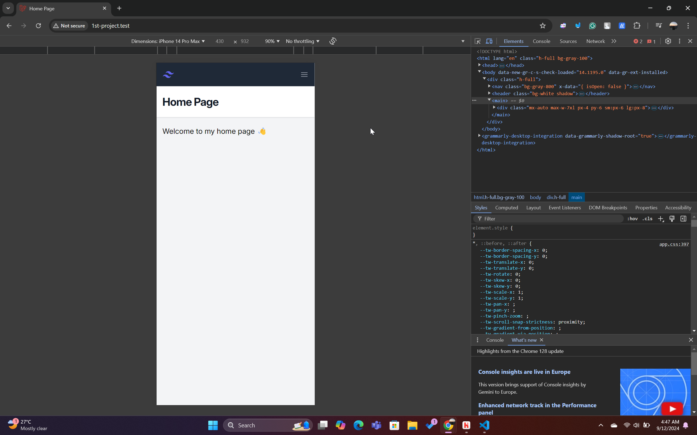
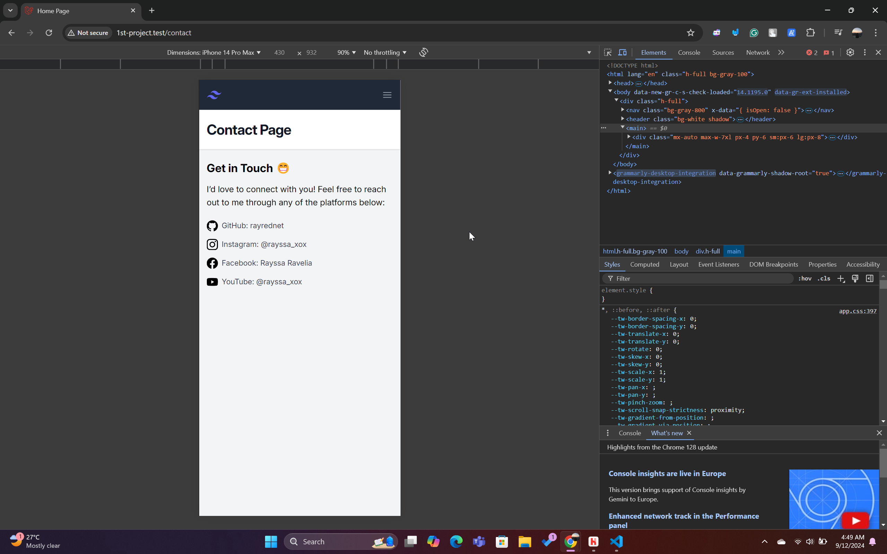
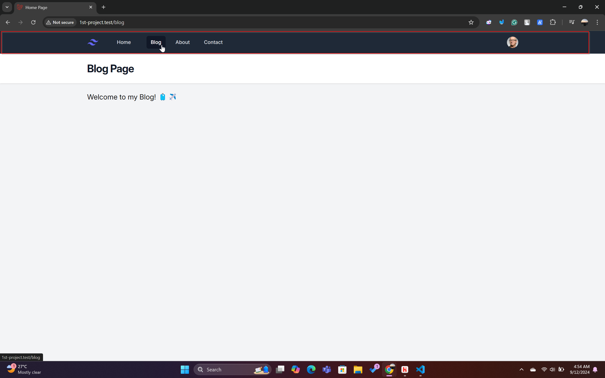
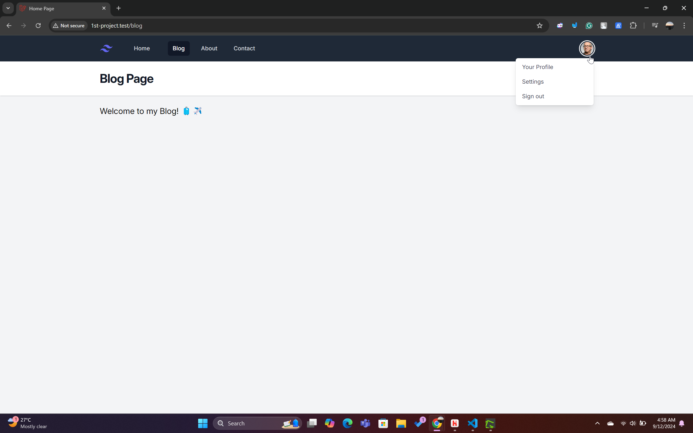
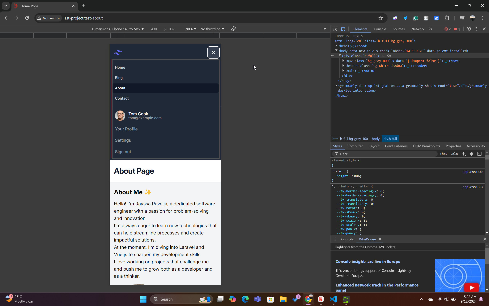

# Section 2 - Laravel Folder Structure and Blade

In this section, I followed tutorials to learn about the Laravel folder structure and Blade templating engine. All the code for this section is located in the **`laravel11/`** subdirectory.

Before running this project, ensure you have all the necessary services installed, including:
- **Nginx**
- **PHP 8.3**

Once the services are properly installed, navigate to the **`laravel11/`** directory and run the following command to start the development environment:

```bash
npm run dev
```

This will compile and serve the assets for your Laravel application.

### Tutorials Followed:
- **A. Installation Review**  
  [Installation Tutorial](https://youtu.be/nW60yGRoUrs?si=QVzCjdFsiLO4qrL-)

- **B. Folder Structure**  
  [Folder Structure Tutorial](https://youtu.be/x55ndgkD2QI?si=7anOzBr9XZXpt7ul)

- **C. Blade Templating Engine**  
  [Blade Templating Engine (Part 1)](https://youtu.be/vDx6VA-6a6Y?si=5KL44NKwp9ToxHs3)  
  [Blade Templating Engine (Part 2)](https://youtu.be/00o1vJYTp4I?si=Rd88-lMuZRQYiS5-)

---

After following the tutorials, I created a web application with the following pages and structure:

- **Home**:  
  The landing page with a welcome message

- **Blog**:  
  Displays articles or posts, serving as a space for sharing updates or tutorials.

- **About**:  
  Provides information about myself

- **Contact**:  
  Allows users to reach out via a form or contact details.


All pages are fully responsive and optimized for both mobile and desktop views.

### Webpage Screenshots:
Here’s the updated version with descriptive alt text for each screenshot:

---

### Webpage Screenshots:
1. **Home Page**
    - Desktop  
    
    - Mobile  
    

2. **Blog Page**
    - Desktop  
    
    - Mobile  
    

3. **About Page**
    - Desktop  
    
    - Mobile  
    

4. **Contact Page**
    - Desktop  
    
    - Mobile  
    


## Key Components

In this project, I designed three main sections: **Navbar**, **Header**, and **Main Content**.

### 1. Navbar

The Navbar allows navigation between the pages and uses different components for mobile and desktop views.

#### 💻 Desktop Navbar (nav-link.blade.php)


As shown in the screenshot, the desktop navbar includes:
- A Laravel logo on the left.
- Page navigation links (Home, Blog, About, Contact) with an indicator showing the currently active page.
- A profile picture on the top-right corner.

When clicking on the profile, a pop-up appears, showing options for **Your Profile**, **Settings**, and **Sign Out**. However, this functionality is not fully implemented in this section yet.



##### Code Explanation
```html
<a {{ $attributes->merge(['class' => ($active ? 'bg-gray-900 text-white' : 'text-gray-300 hover:bg-gray-700 hover:text-white') . ' block sm:inline-block sm:mr-4 px-3 py-2 text-sm font-medium rounded-md']) }} 
    aria-current="{{ $active ? 'page' : false }}">
        {{ $slot }}
</a>
```

In this code:
- **$active**: A boolean variable that checks whether the current page matches the link's URL. If it does, `$active` becomes `true`, highlighting the active page by adding the `bg-gray-900 text-white` classes.
- **$attributes**: This is used to merge additional HTML attributes that may be passed when calling the component. It adds further customization or properties to the `<a>` tag, such as custom classes or additional data.
- **$slot**: This represents the content inside the component (the page name like "Home" or "Blog"). 

##### How It Works in the Template
```html
<x-nav-link href="/" :active="request()->is('/')"> Home </x-nav-link>
<x-nav-link href="/blog" :active="request()->is('blog')"> Blog </x-nav-link>
<x-nav-link href="/about" :active="request()->is('about')"> About </x-nav-link>
<x-nav-link href="/contact" :active="request()->is('contact')"> Contact </x-nav-link>
```

Here’s how this works:
- The component `<x-nav-link>` is called with the **href** attribute (link to the page) and the **active** state (checking if the current request matches the page's route).
- For example, when the user is on the "Home" page, `request()->is('/')` returns `true`, setting `$active` to `true`, thus highlighting the "Home" link.

#### 📱 Mobile Navbar (nav-link-mobile.blade.php)



In mobile view (as shown by the red rectangle), the navbar layout changes:
- It becomes more block-styled, with the menu items stacked vertically.
- Clicking on the **hamburger button** (top-right) opens the mobile menu, displaying the **Profile, Settings, and Sign Out** options directly under the user's profile picture.

##### Code Explanation for Mobile Navbar
```html
<a {{ $attributes->merge(['class' => ($active ? 'bg-gray-900 text-white' : 'text-gray-300 hover:bg-gray-700 hover:text-white') . ' block px-3 py-2 text-sm font-medium rounded-md']) }} 
    aria-current="{{ $active ? 'page' : false }}">
        {{ $slot }}
</a>
```

- This code functions similarly to the desktop navbar code. The key difference here is the layout:
  - In mobile, the classes create a more **block-oriented** design (`block px-3 py-2`), where the links stack vertically instead of inline.

##### How It Works in the Template
```html
<x-nav-link-mobile href="/" :active="request()->is('/')"> Home </x-nav-link-mobile>
<x-nav-link-mobile href="/blog" :active="request()->is('blog')"> Blog </x-nav-link-mobile>
<x-nav-link-mobile href="/about" :active="request()->is('about')"> About </x-nav-link-mobile>
<x-nav-link-mobile href="/contact" :active="request()->is('contact')"> Contact </x-nav-link-mobile>
```

Similar to the desktop version:
- Each link component (`<x-nav-link-mobile>`) is called with the **href** attribute and **active** status based on the current page.
- The **mobile navbar** differs from the desktop version in its visual structure and functionality. The **Profile, Settings, and Sign Out** options are displayed as a part of the expanded menu rather than in a pop-up.

#### Combining Desktop and Mobile Navbars
The `navbar.blade.php` file contains both the desktop and mobile versions of the navbar, and the appropriate version is shown based on the screen size or device. This approach ensures a responsive design for both desktop and mobile users.

### 2. Header and Main Layout

The **Header** and **Main Content** sections of the webpage are structured using the layout defined in `layout.blade.php`. This layout ensures that all pages share a consistent structure, including the navigation bar (navbar), header, and main content area. The code looks like this:

```html
<!DOCTYPE html>
<html lang="en" class="h-full bg-gray-100">
<head>
    <meta charset="UTF-8">
    <meta name="viewport" content="width=device-width, initial-scale=1.0">
    @vite('resources/css/app.css')
    <link rel="stylesheet" href="https://rsms.me/inter/inter.css">
    <script defer src="https://cdn.jsdelivr.net/npm/alpinejs@3.x.x/dist/cdn.min.js"></script>
    <title>{{ $title }}</title>
</head>
<body>
    <div class="h-full">
        <x-navbar />
        <x-header>{{ $title }}</x-header>
        <main>
            <div class="mx-auto max-w-7xl px-4 py-6 sm:px-6 lg:px-8">
                {{ $slot }}
            </div>
        </main>
    </div>
</body>
</html>
```

#### Key Components:
- **`<x-navbar />`**: This includes the navigation bar (navbar), which allows users to switch between pages like Home, Blog, About, and Contact.
  
- **`<x-header>{{ $title }}</x-header>`**: This dynamically inserts the `$title` variable into the header section of the page. The title value is passed from each route, allowing the header to reflect the current page. For example, on the blog page, the title "Blog Page" is displayed.

- **`{{ $slot }}`**: This is where the main content of each page is rendered. The specific content for each page is passed into this slot.

#### Passing the Title:
The title for each page is passed through the layout by defining the `$title` variable, as shown below:

```html
<x-layout>
    <x-slot:title>{{ $title }}</x-slot>
    <h3 class="text-xl">Welcome to my Blog! 🧳✈️</h3>
</x-layout>
```

In this example, the **`<x-layout>`** component is used to apply the layout to the page, and the **`<x-slot:title>`** tag sets the title for that specific page. The title is then displayed in the header using the `{{ $title }}` placeholder.

#### Example Output:
For the blog page, when the title "Blog Page" is passed from the route, the header will display that title, as shown in the screenshot below. The red rectangle highlights where the title is dynamically rendered.


The title "Blog Page" is passed from the route file (`web.php`), which will be explained in the next section.

### 3. Routes Setup

In Laravel, routes define the URLs of your web application and specify which view (or logic) should be rendered when those URLs are visited. The page title and other variables are passed from the `web.php` route file to the corresponding Blade templates as shown below:

```php
<?php

use Illuminate\Support\Facades\Route;

Route::get('/', function () {
    return view('home', ['title' => 'Home Page']);
});

Route::get('/about', function () {
    return view('about', ['name' => 'Rayssa Ravelia', 'title' => 'About Page']);
});

Route::get('/blog', function () {
    return view('blog', ['title' => 'Blog Page']);
});

Route::get('/contact', function () {
    return view('contact', ['title' => 'Contact Page']);
});
```

#### Explanation of Passed Variables:
- **`title`**: This variable is passed for every page and is used in the header section. It dynamically sets the title for each page. For example, on the Home page, the title is passed as `'Home Page'`, and on the About page, it’s `'About Page'`. This title is displayed in the header using the following line in the Blade template:
  
  ```html
  <x-header>{{ $title }}</x-header>
  ```

  In the template for each page, this variable ensures that the appropriate title is displayed in the header section for the current page.

- **`name`** (used in the About page):
  
  On the About page, the variable `name` is passed with the value `'Rayssa Ravelia'`. This variable is used within the content of the About page to display my name as part of the introduction. It’s rendered in the template as follows:

  ```html
  Hello! I'm {{ $name }}, a dedicated software engineer with a passion for problem-solving and innovation
  ```

  This code dynamically inserts the value of `$name` into the page, greeting the user with your name.

Thus, when you visit `/about`, the content will be displayed as:
  
```
Hello! I'm Rayssa Ravelia, a dedicated software engineer with a passion for problem-solving and innovation
```

The same pattern applies to other pages, but the **name** variable is unique to the **About** page, while the **title** variable is used in every page to set the header.
