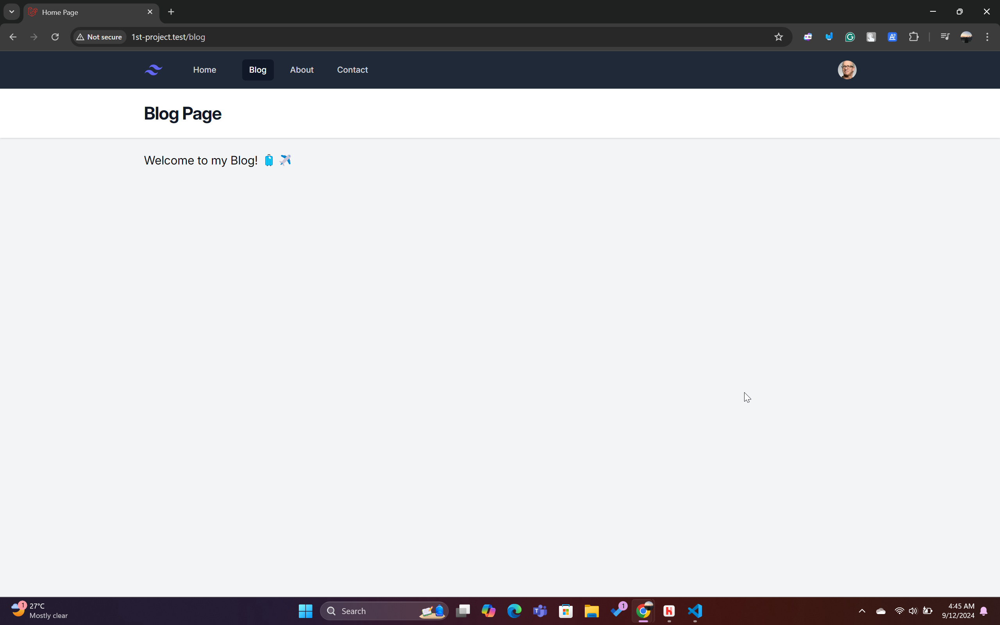

# Section 3 - View Data and Model

In this section, I continued from the previous section, focusing on displaying data through views and implementing a model. The tutorials I followed are:

- **View Data**: [Link to video](https://youtu.be/76YsC4EjGE4)
- **Model**: [Link to video](https://youtu.be/dzjBbvKjbaQ)

### Changes in This Section
All the files for this section can be found in the `laravel11/` directory. Before running the project, ensure the dev environment is started using the following command:
```bash
npm run dev
```

After following the tutorials, the primary changes made were on the blog page. As you can see in the image below:


There are now two blog articles displayed, compared to the old one `blog-old.png` below which was blank.



### Blog Page View
In the updated blog page, each article is sourced from a model (in this section, we are not yet using a database to simplify the process). Each article title is clickable, leading to its detailed view on a separate page.

The code used for displaying blog posts is as follows, located in `laravel11/resources/views/posts.blade.php`:

```php
<x-layout>
    <x-slot:title>{{ $title }}</x-slot>
    <h3 class="text-xl"> Welcome to my Blog! 🧳✈️</h3>

    @foreach ($posts as $post)
        <article class="py-8 max-w-screen-md border-b border-gray-300">
            <a href="/posts/{{ $post['slug'] }}" class="hover:underline">
                <h2 class="mb-1 text-3xl tracking-tight font-bold text-gray-900">{{ $post['title'] }}</h2>
            </a>
            <div class="text-base text-gray-500">
                <a href="#">{{ $post['author'] }}</a> | January 1st 2024
            </div>
            <p class="my-4 font-light">{{ Str::limit($post['body'], 150) }}</p>
            <a href="/posts/{{ $post['slug'] }}" class="font-medium text-blue-500 hover:underline">Read more &raquo;</a>
        </article>
    @endforeach
</x-layout>
```

#### Code Explanation
- The `@foreach` loop iterates over the list of posts (sourced from the model) and displays them as individual articles.
- Each article can be clicked, and it directs to a separate page using the `slug` of the post.
- **Slug**: A slug is a URL-friendly version of a post's title, typically used to make URLs more readable and descriptive.

The view for individual articles can be found in `laravel11/resources/views/post.blade.php`. Note that it's named `post` (singular) compared to `posts` (plural) for the blog page.

```php
<x-layout>
    <x-slot:title>{{ $title }}</x-slot>
    <a href="/posts/" class="font-medium text-blue-500 hover:underline">&laquo; Back to posts</a>

    <article class="py-8 max-w-screen-md border-b">
        <h2 class="mb-1 text-3xl tracking-tight font-bold text-gray-900">{{ $post['title'] }}</h2>
        <div class="text-base text-gray-500">
            <a href="#">{{ $post['author'] }}</a> | January 1st 2024
        </div>
        <p class="my-4 font-light">{{ $post['body'] }}</p>
    </article>
</x-layout>
```

This code handles displaying the details of each blog post. Currently, the date is a placeholder, which will be dynamically set when we connect to a database in the future. 

For example, the single post looks like this:


### Model
In this section, we use the **Model** to store and retrieve data for the posts. Here’s the general structure of how Laravel's MVC (Model-View-Controller) architecture works:


1. A user action triggers a route to a controller.
2. The controller interacts with the model if data retrieval is necessary.
3. The model fetches data (currently hardcoded, will be dynamic in the future).
4. The controller renders the view in the user’s browser.

We store the model data in `laravel11/app/Models/Post.php`:

```php
<?php

namespace App\Models;

use Illuminate\Support\Arr;

class Post {
    public static function all() {
        return [
            [
                'id' => 1,
                'slug' => 'my-internship-experience-in-taiwan',
                'title' => 'My Internship Experience in Taiwan',
                'author' => 'Rayssa Ravelia',
                'body' => 'Last summer, I had the amazing opportunity to travel to Taiwan for an internship...',
            ],
            [
                'id' => 2,
                'slug' => 'a-relaxing-getaway-to-bali',
                'title' => 'A Relaxing Getaway to Bali',
                'author' => 'Rayssa Ravelia',
                'body' => 'Bali is always a great escape from the busy city life...',
            ]
        ];
    }

    public static function find($slug): array {
        $post = Arr::first(static::all(), fn($post) => $post['slug'] === $slug);
        if(!$post) {
            abort(404);
        }
        return $post;
    }
}
```

#### Code Explanation
- This model saves the post data with fields like `id`, `slug`, `title`, `author`, and `body`.
- The `find($slug)` function searches for posts by their slug, and if none is found, it triggers a `404` error page.
- For example, if a user searches for a post using an invalid slug like `lala`, the system will return a 404 error page like below:


### Routes
Previously, we were storing post data directly in the routes. Now, we utilize the `Post` model for this. The updated routes are in `laravel11/routes/web.php`:

```php
<?php

use App\Models\Post;
use Illuminate\Support\Facades\Route;

Route::get('/', function () {
    return view('home', ['title' => 'Home Page']);
});

Route::get('/about', function () {
    return view('about', ['title' => 'About Page']);
});

Route::get('/posts', function () {
    return view('posts', ['title' => 'Blog Page', 'posts' => Post::all()]);
});

Route::get('/posts/{slug}', function ($slug) {
    return view('post', ['title' => 'Single Post', 'post' => Post::find($slug)]);
});

Route::get('/contact', function () {
    return view('contact', ['title' => 'Contact Page']);
});
```

#### Code Explanation
- We use the `Post` model to retrieve all posts for the `/posts` route and display them.
- For individual posts, we use the `find($slug)` function to retrieve the post data based on the slug provided in the URL.

