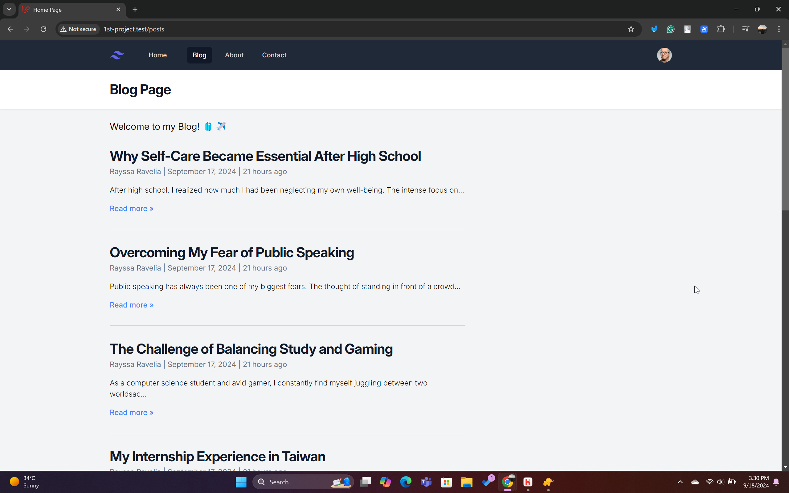
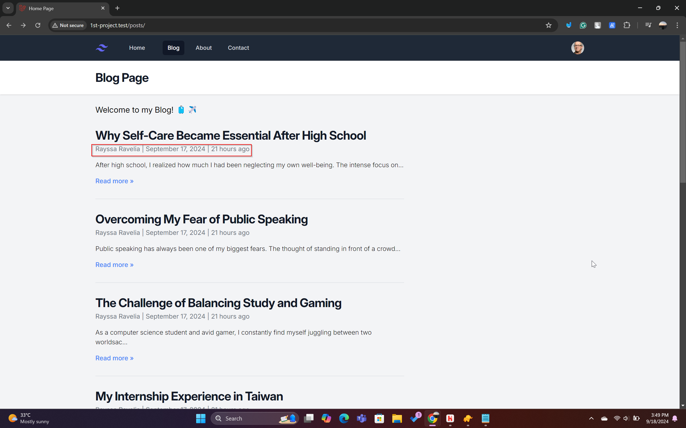
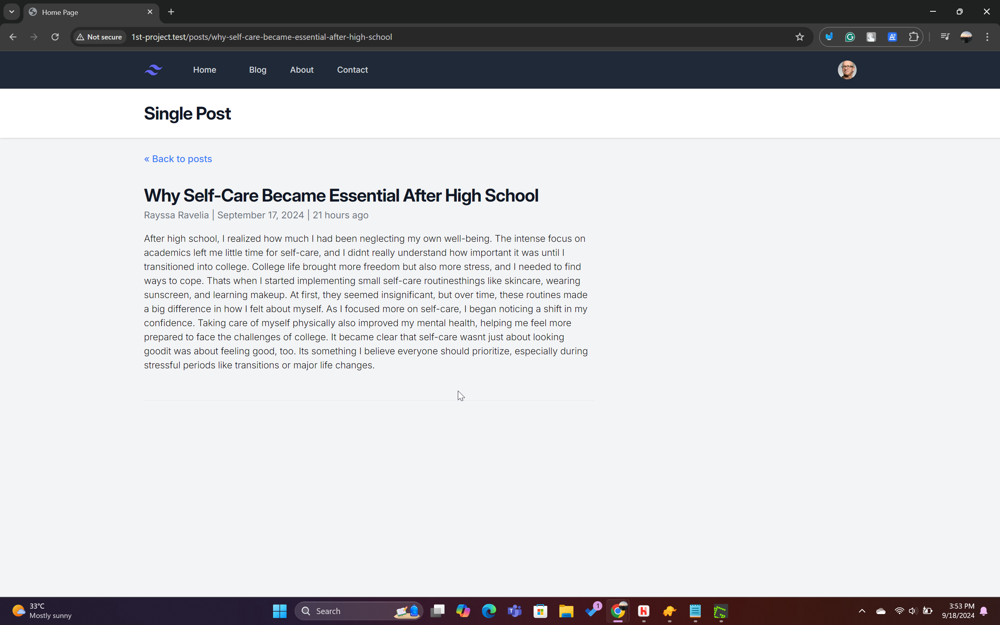

# Section 4 - Database Integration and Eloquent ORM

## Overview
In this section, I integrate the database using SQLite and implement Eloquent ORM for handling data on our blog website. I'll walk through the process of setting up the database, creating models, and handling data using Laravel's Eloquent ORM.

### Tutorials Followed
1. **Database & Migration**: [YouTube Tutorial](https://youtu.be/eghZY9-3Wko)
2. **Eloquent ORM & Post Model**: [YouTube Tutorial](https://youtu.be/dW3-33iMYkk)

### Dev Environment Setup
Before running the project, make sure you have the dev environment set up using this command:
```bash
npm run dev
```

## UI Updates
The UI remains largely unchanged from previous sections. The primary change in this section is how the data is stored and retrieved from the database, which is reflected in the blog section.

Here’s an example of how the blog section looks now:


## Database Configuration
We are using **SQLite** for this project, as it suits the requirements for a simple blog site. The database configuration is stored in the `.env` file:

```plaintext
DB_CONNECTION=sqlite
```

You can find the relevant entries for configuring the database and other application settings in the `.env` file:
```plaintext
APP_NAME=Laravel
APP_ENV=local
APP_KEY=base64:1CwBdBnNPjKGBYlw5E+vklLlhuCUtXvxmBsAliKBsAc=
APP_DEBUG=true
APP_TIMEZONE=UTC
APP_URL=http://1st-project.test

SESSION_DRIVER=database
SESSION_LIFETIME=120

CACHE_STORE=database
CACHE_PREFIX=
```

### Eloquent ORM in Laravel
Previously, the data was hardcoded within the views. Now, we are using **Eloquent ORM**, which allows us to interact with the database using models. In Laravel, models are located in the `App/Models` directory.

Here is our `Post` model (`app/Models/Post.php`):
```php
<?php

namespace App\Models;

use Illuminate\Database\Eloquent\Factories\HasFactory;
use Illuminate\Database\Eloquent\Model;

class Post extends Model
{
    use HasFactory;
    protected $fillable = ['title', 'author', 'slug', 'body'];
}
```
This model corresponds to the `posts` table in the database and specifies the fields (`title`, `author`, `slug`, `body`) that can be filled when creating a new post. 

### Migration File for Posts Table
A **migration** in Laravel is used to define the structure of the database tables. It allows us to easily create and update the database schema.

Here is the migration file that creates the `posts` table:
```php
<?php

use Illuminate\Database\Migrations\Migration;
use Illuminate\Database\Schema\Blueprint;
use Illuminate\Support\Facades\Schema;

return new class extends Migration
{
    public function up(): void
    {
        Schema::create('posts', function (Blueprint $table) {
            $table->id();
            $table->string('title');
            $table->string('author');
            $table->string('slug')->unique();
            $table->text('body');
            $table->timestamps();
        });
    }

    public function down(): void
    {
        Schema::dropIfExists('posts');
    }
};
```
This migration creates a `posts` table with fields for `id`, `title`, `author`, `slug`, `body`, and timestamps (`created_at`, `updated_at`).

### Entering Data Using PHP Artisan Tinker
We use **PHP Artisan Tinker** to interact with the database in the terminal. Tinker allows us to run PHP commands interactively within a Laravel project.

Here’s how we insert a new post into the database using Tinker:
```bash
php artisan tinker
```
Then, we can create a post with the following command:
```php
App\Models\Post::create([
    'slug' => 'why-self-care-became-essential-after-high-school',
    'title' => 'Why Self-Care Became Essential After High School',
    'author' => 'Rayssa Ravelia',
    'body' => 'After high school, I realized how much I had been neglecting my own well-being...'
]);
```
Fields like `id`, `created_at`, and `updated_at` are filled automatically.

## View Changes (Author and Date Formatting)
Earlier, we hardcoded the author and date in `resources/views/posts.blade.php`. Now, we dynamically fetch the post details, including the author and formatted date.

Here’s the updated code:
```php
<x-layout>
    <x-slot:title>{{ $title }}</x-slot>
    <h3 class="text-xl">Welcome to my Blog! 🧳✈️</h3>

    @foreach ($posts as  $post)
    <article class="py-8 max-w-screen-md border-b border-gray-300">
      <a href="/posts/{{ $post['slug'] }}" class="hover:underline">
        <h2 class="mb-1 text-3xl tracking-tight font-bold text-gray-900">{{ $post['title'] }}</h2>
      </a>
      <div class="text-base text-gray-500">
        <a href="#">{{ $post['author'] }}</a> | {{ $post['created_at']->format('F j, Y') }} | {{ $post['created_at']->diffForHumans() }}
      </div>
      <p class="my-4 font-light">{{ Str::limit($post['body'], 200) }}</p>
      <a href="/posts/{{ $post['slug'] }}" class="font-medium text-blue-500 hover:underline">Read more &raquo;</a>
    </article>
    @endforeach
</x-layout>
```
### Explanation of `created_at->format` and `diffForHumans()`
- **`created_at->format('F j, Y')`**: Formats the date in a human-readable format (e.g., "September 17, 2024").
- **`created_at->diffForHumans()`**: Displays a relative time format (e.g., "21 hours ago").

Here’s what the blog looks like:


When we click on a post, the single post view is also updated similarly:


This is the corresponding code from `resources/views/post.blade.php`:
```php
<x-layout>
    <x-slot:title>{{ $title }}</x-slot>
    <a href="/posts/" class="font-medium text-blue-500 hover:underline">&laquo; Back to posts</a>

    <article class="py-8 max-w-screen-md border-b">
      <h2 class="mb-1 text-3xl tracking-tight font-bold text-gray-900">{{ $post['title'] }}</h2>

      <div class="text-base text-gray-500">
        <a href="#">{{ $post['author'] }}</a> | {{ $post['created_at']->format('F j, Y') }} | {{ $post['created_at']->diffForHumans() }}
      </div>
      <p class="my-4 font-light">{{ $post['body'] }}</p>
    </article>
</x-layout>
```

In this format, both the list view and individual post views show the author and date in a dynamic format, leveraging Laravel’s features.
