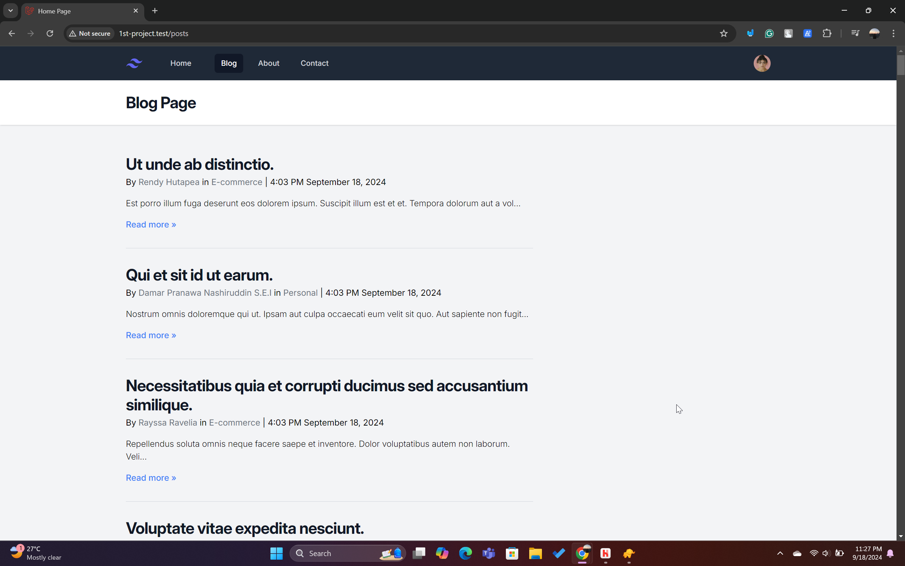
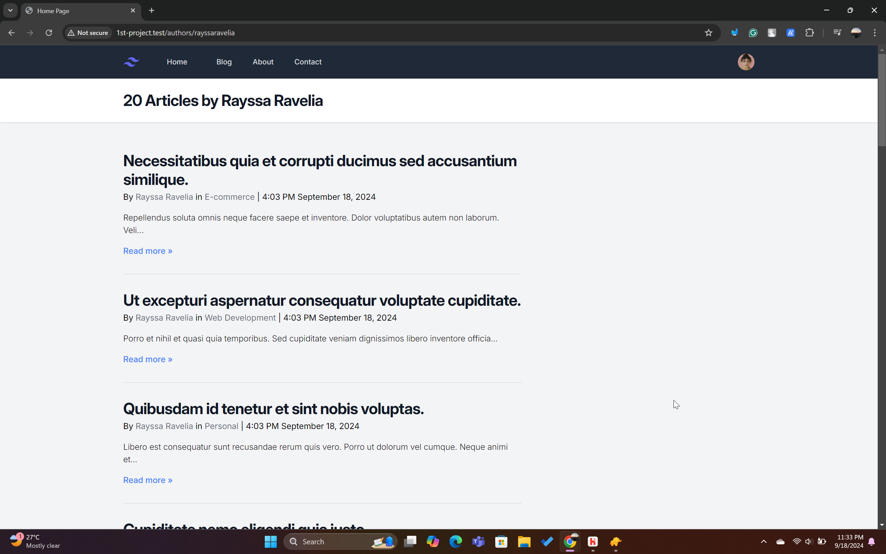
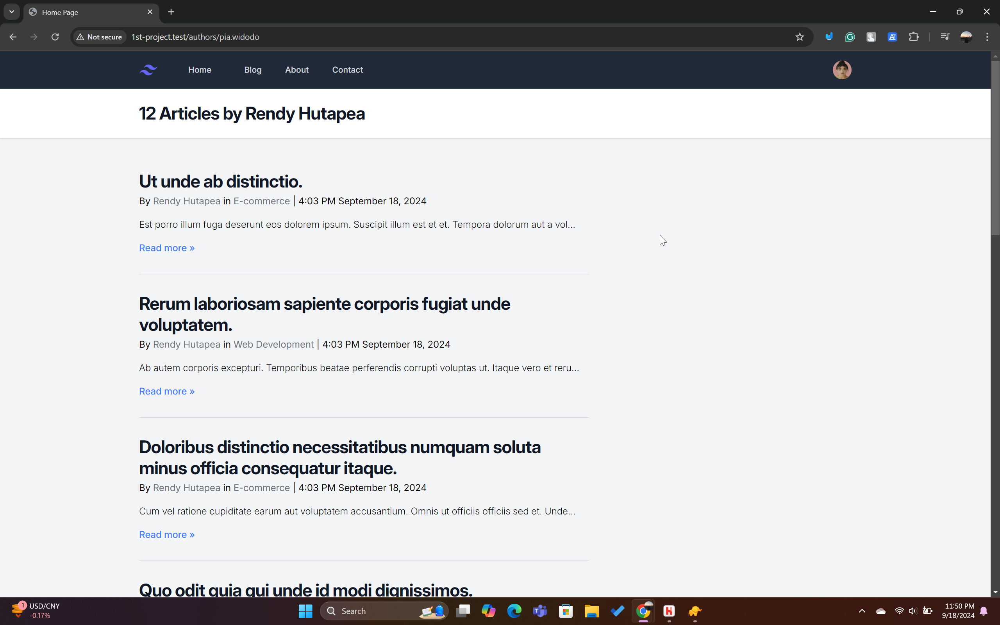
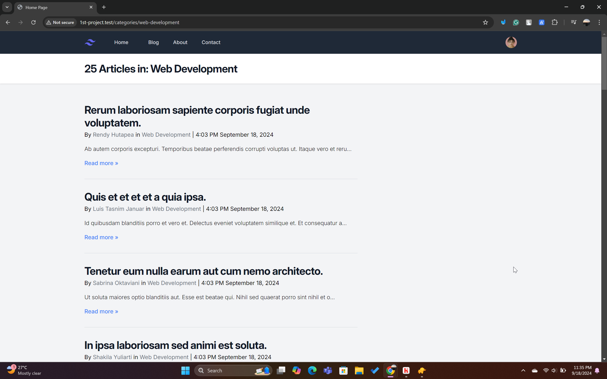
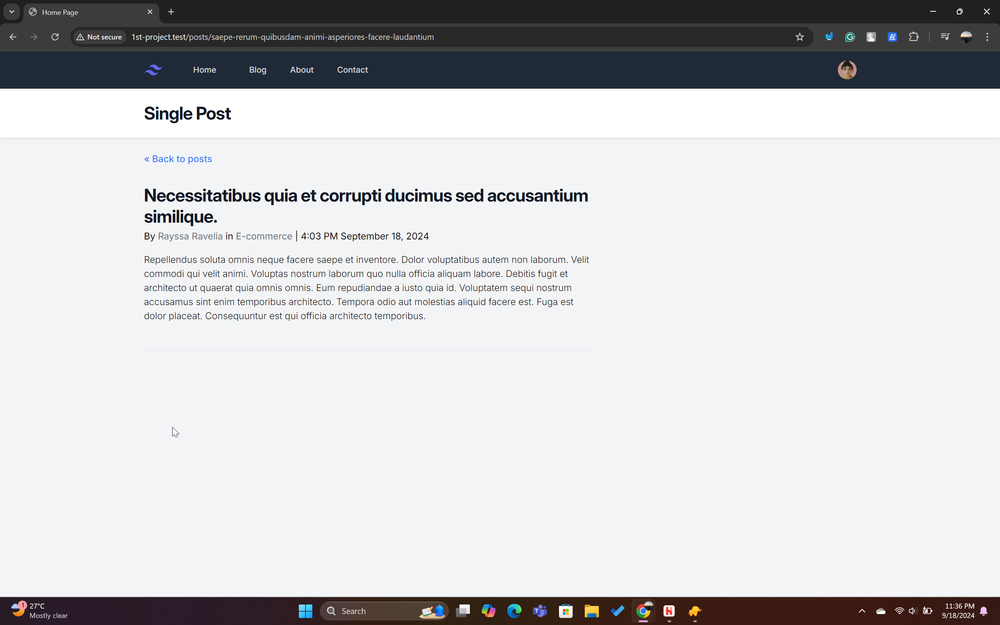
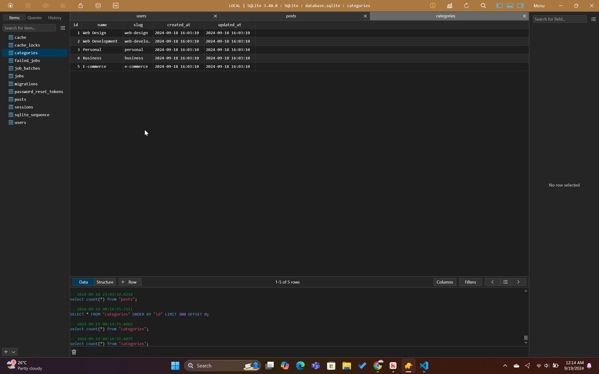
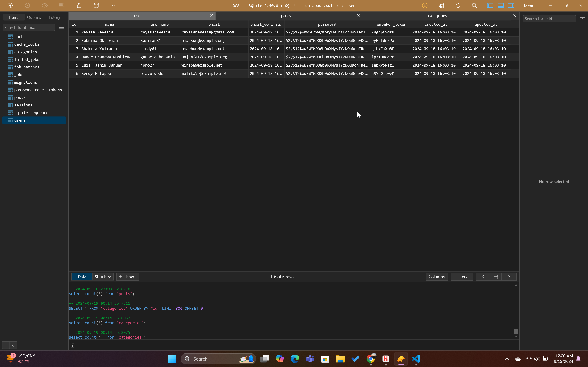
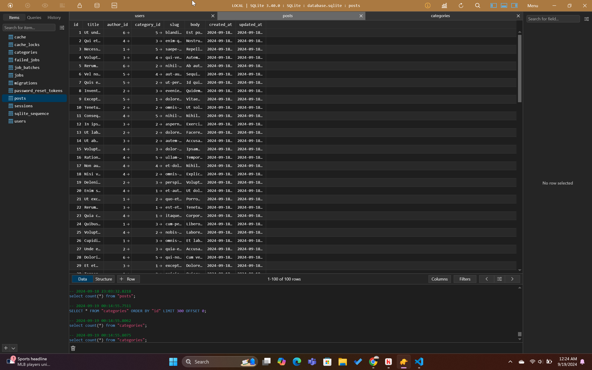

# Section 5 - Enhancing Data Management in Laravel

## Overview
In this section, we enhance the data management capabilities of our Laravel project by implementing **model factories**, **Eloquent relationships**, and **database seeders**. This builds upon the previous section, where we introduced databases and Eloquent ORM.

### Tutorials Referenced:
- **Model Factories:** [YouTube Tutorial](https://youtu.be/1wWXyO4iuBA)
- **Eloquent Relationship:** [YouTube Tutorial](https://youtu.be/S2eh1VnHu40) | [YouTube Tutorial](https://youtu.be/jineNX34OYE)
- **Database Seeder:** [YouTube Tutorial](https://youtu.be/rAv8C0Nf9uk)

All code from this section is located in the `laravel11/` subdirectory.

---

## Development Environment Setup

Before running the project, ensure your development environment is correctly set up. Run the following command:

```bash
npm run dev
```

---

## User Interface Changes

Following the tutorials, we've made some changes to the UI, specifically on the **Blog Page**.

- The blog page now looks like this:
  

- As you can see, the blog entries’ titles and bodies don't make much sense because they are randomly generated by seeders. Additionally, each blog entry now includes a **category** section.
  
- The author names and category names are styled in gray, and they are clickable links, indicating to users that these elements can be interacted with.

- Clicking on the author's name brings up all articles written by that author:
  

  The URL for an author like *Rayssa Ravelia* is structured as: `http://1st-project.test/authors/rayssaravelia`. This makes sense because I manually input Rayssa's author data. However, for other authors generated by seeders, the slugs may not match the actual names. For example, the slug for *Rendy Hutapea* is `pia.widodo` because this data was generated by the seeder.

  

- Similarly, when clicking on a **category name**, it shows all articles belonging to that category:
  

  The slug for the *Web Development* category, for example, is `http://1st-project.test/categories/web-development`. I predefined these categories and slugs in the database seeder.

- On the **Single Post Page**, the UI corresponds to the blog page, with clickable author and category names:
  

  The slug of a single post is generated automatically based on the title, which may not exactly match the title, as seen here: `http://1st-project.test/posts/saepe-rerum-quibusdam-animi-asperiores-facere-laudantium`.

---

## Code Breakdown

### Models

In the `models` directory, there are three key files:

1. **Category.php**
   ```php
   <?php
   
   namespace App\Models;

   use Illuminate\Database\Eloquent\Factories\HasFactory;
   use Illuminate\Database\Eloquent\Model;

   class Category extends Model
   {
       use HasFactory;

       public function posts()
       {
           return $this->hasMany(Post::class);
       }
   }
   ```

   - The `Category` model has a one-to-many relationship with the `Post` model, meaning each category can have many posts.

2. **Post.php**
   ```php
   <?php

   namespace App\Models;

   use Illuminate\Database\Eloquent\Factories\HasFactory;
   use Illuminate\Database\Eloquent\Model;
   use Illuminate\Database\Eloquent\Relations\BelongsTo;

   class Post extends Model
   {
       use HasFactory;
       protected $fillable = ['title', 'author', 'slug', 'body'];

       public function author(): BelongsTo
       {
           return $this->belongsTo(User::class);
       }

       public function category(): BelongsTo
       {
           return $this->belongsTo(Category::class);
       }
   }
   ```

   - The `Post` model uses `belongsTo` relationships to both `User` (author) and `Category`, indicating that each post is associated with one user and one category.

3. **User.php**
   ```php
   <?php

   namespace App\Models;

   use Illuminate\Notifications\Notifiable;
   use Illuminate\Database\Eloquent\Relations\HasMany;
   use Illuminate\Database\Eloquent\Factories\HasFactory;
   use Illuminate\Foundation\Auth\User as Authenticatable;

   class User extends Authenticatable
   {
       use HasFactory, Notifiable;

       protected $fillable = ['name', 'email', 'password'];

       protected $hidden = ['password', 'remember_token'];

       public function posts(): HasMany
       {
           return $this->hasMany(Post::class, 'author_id');
       }
   }
   ```

   - The `User` model has a one-to-many relationship with `Post`, meaning each user (author) can have many posts. The `author_id` field serves as a foreign key.

### Factories

Factories help generate dummy data for testing purposes.

1. **CategoryFactory.php**
   ```php
   <?php

   namespace Database\Factories;

   use Illuminate\Support\Str;
   use Illuminate\Database\Eloquent\Factories\Factory;

   class CategoryFactory extends Factory
   {
       public function definition(): array
       {
           return [
               'name' => fake()->sentence(rand(1, 2), false),
               'slug' => Str::slug(fake()->sentence(rand(1, 2), false)),
           ];
       }
   }
   ```

   - `name`: This generates a fake sentence between 1 to 2 words, which will serve as the name of the category.
   - `slug`: The name is converted into a URL-friendly string using `Str::slug()`, ensuring there are no spaces or special characters.

2. **PostFactory.php**
   ```php
   <?php

   namespace Database\Factories;

   use App\Models\User;
   use App\Models\Category;
   use Illuminate\Support\Str;
   use Illuminate\Database\Eloquent\Factories\Factory;

   class PostFactory extends Factory
   {
       public function definition(): array
       {
           return [
               'title' => fake()->sentence(),
               'author_id' => User::factory(),
               'category_id' => Category::factory(),
               'slug' => Str::slug(fake()->sentence()),
               'body' => fake()->paragraph(10),
           ];
       }
   }
   ```

   - `title`: Generates a random sentence to serve as the title of the post.
   - `author_id`: Each post is associated with a randomly generated user.
   - `category_id`: Each post is also associated with a randomly generated category.
   - `slug`: The title is slugged for the post’s URL.
   - `body`: Generates a paragraph of 10 sentences as the body of the post.

3. **UserFactory.php**
   ```php
   <?php

   namespace Database\Factories;

   use Illuminate\Support\Facades\Hash;
   use Illuminate\Support\Str;
   use Illuminate\Database\Eloquent\Factories\Factory;

   class UserFactory extends Factory
   {
       public function definition(): array
       {
           return [
               'name' => fake()->name(),
               'username' => fake()->unique()->userName(),
               'email' => fake()->unique()->safeEmail(),
               'password' => Hash::make('password'),
               'remember_token' => Str::random(10),
           ];
       }
   }
   ```

   - `name`: Generates a fake name for the user.
   - `username`: Generates a unique username for each user.
   - `email`: Generates a unique and safe email address.
   - `password`: Hashes the password using `Hash::make()`.
   - `remember_token`: Generates a random token for the remember feature.

### Migrations

In the `migrations` directory, three files manage the database structure:

1. **User Migration**
   - Adds a unique `username` field for routing.
   - Table: `users`

   ```php
   <?php

   use Illuminate\Database\Migrations\Migration;
   use Illuminate\Database\Schema\Blueprint;
   use Illuminate\Support\Facades\Schema;

   return new class extends Migration
   {
       public function up(): void
       {
           Schema::create('users', function (Blueprint $table) {
               $table->id();
               $table->string('name');
               $table->string('username')->unique();
               $table->string('email')->unique();
               $table->timestamp('email_verified_at')->nullable();
               $table->string('password');
               $table->rememberToken();
               $table->timestamps();
           });
       }

       public function down(): void
       {
           Schema::dropIfExists('users');
       }
   };
   ```

2. **Post Migration**
   - Adds `author_id` and `category_id` as foreign keys.
   - Table: `posts`

   ```php
   <?php

   use Illuminate\Database\Migrations\Migration;
   use Illuminate\Database\Schema\Blueprint;
   use Illuminate\Support\Facades\Schema;

   return new class extends Migration
   {
       public function up(): void
       {
           Schema::create('posts', function (Blueprint $table) {
               $table->id();
               $table->string('title');
               $table->foreignId('author_id')->constrained('users');
               $table->foreignId('category_id')->constrained('categories');
               $table->string('slug')->unique();
               $table->text
               $table->timestamps();
           });
       }

       public function down(): void
       {
           Schema::dropIfExists('posts');
       }
   };
   ```

3. **Category Migration**
   - Adds `name` and `slug`.
   - Table: `categories`

   ```php
   <?php

   use Illuminate\Database\Migrations\Migration;
   use Illuminate\Database\Schema\Blueprint;
   use Illuminate\Support\Facades\Schema;

   return new class extends Migration
   {
       public function up(): void
       {
           Schema::create('categories', function (Blueprint $table) {
               $table->id();
               $table->string('name');
               $table->string('slug')->unique();
               $table->timestamps();
           });
       }

       public function down(): void
       {
           Schema::dropIfExists('categories');
       }
   };
   ```

### Seeder

Seeders generate data for the database using factories and manual inputs.

Now, instead of using the `php artisan tinker` command to write entries to the database manually, we can run:

```bash
php artisan migrate:fresh --seed
```

This command will migrate the database and run the seeds automatically.

1. **CategorySeeder.php**
   ```php
   <?php

   namespace Database\Seeders;

   use App\Models\Category;
   use Illuminate\Database\Seeder;

   class CategorySeeder extends Seeder
   {
       /**
        * Run the database seeds.
        */
       public function run(): void
       {
           Category::create([
               'name' => 'Web Design',
               'slug' => 'web-design',
           ]);

           Category::create([
               'name' => 'Web Development',
               'slug' => 'web-development',
           ]);

           Category::create([
               'name' => 'Personal',
               'slug' => 'personal',
           ]);

           Category::create([
               'name' => 'Business',
               'slug' => 'business',
           ]);

           Category::create([
               'name' => 'E-commerce',
               'slug' => 'e-commerce',
           ]);
       }
   }
   ```

   - As you can see, I have predefined the category names and slugs. As shown in the picture below, the slugs and names correspond correctly.
    
   **TablePlus view:**
   

2. **UserSeeder.php**
   ```php
   <?php

   namespace Database\Seeders;

   use App\Models\User;
   use Illuminate\Support\Str;
   use Illuminate\Database\Seeder;
   use Illuminate\Support\Facades\Hash;

   class UserSeeder extends Seeder
   {
       /**
        * Run the database seeds.
        */
       public function run(): void
       {
           User::create([
               'name' => 'Rayssa Ravelia',
               'username' => 'rayssaravelia',
               'email' => 'rayssaravelia@gmail.com',
               'email_verified_at' => now(),
               'password' => Hash::make('password'),
               'remember_token' => Str::random(10),
           ]);
           
           User::factory(5)->create();
       }
   }
   ```

   - Here, I've manually added the user *Rayssa Ravelia*, so the slug corresponds to the author's name, as seen in the image below. 

   

   Additionally, five more users are generated by the factory.

   **TablePlus view:**
   

   Now there are 6 authors, but only *Rayssa's* username matches the name directly. For others, like *Rendy Hutapea*, the slug is different, as seen in the image below.
   
   

3. **DatabaseSeeder.php**
   ```php
   <?php

   namespace Database\Seeders;

   use App\Models\Post;
   use App\Models\User;
   use App\Models\Category;
   use Illuminate\Database\Seeder;

   class DatabaseSeeder extends Seeder
   {
       /**
        * Seed the application's database.
        */
       public function run(): void
       {
           $this->call([
               UserSeeder::class,
               CategorySeeder::class,
           ]);

           Post::factory(100)->recycle([Category::all(), User::all()])->create();
       }
   }
   ```

   - In this Seeder, I call the user and category factories, then generate 100 posts. The `recycle` function ensures that the posts are created using the existing 5 categories and 6 authors.

   **TablePlus view:**
   

---

### Views and Routes

The views `posts.blade.php` and `post.blade.php` render the blog and post pages, respectively, with clickable author and category names.

#### `posts.blade.php`

```php
<x-layout>
    <x-slot:title>{{ $title }}</x-slot>
    @foreach ($posts as  $post)
    <article class ="py-8 max-w-screen-md border-b border-gray-300">
      <a href ="/posts/{{ $post['slug'] }}" class = hover:underline>
        <h2 class = "mb-1 text-3xl tracking-tight font-bold text-gray-900"> {{ $post ['title'] }}</h2>
      </a>
      <div>
        By
        <a href="/authors/{{ $post->author->username }}" 
          class="hover:underline text-gray-500" >  {{ $post->author->name }}</a> 
          in 
          <a href="/categories/{{ $post->category->slug }}" class="hover:underline text-gray-500"> 
            {{ $post->category->name }}</a>
          | {{ $post ['created_at'] ->format('g:i A F j, Y ') }} 
      </div>
      <p class = "my-4 font-light"> {{ Str::limit ($post ['body']),200 }}</p>
      </p>
      <a href ="/posts/{{ $post['slug'] }}" class ="font-medium text-blue-500 hover:underline ">Read more &raquo;</a>
    </article>
    @endforeach
</x-layout>
```

- This view displays the blog page with posts, authors, and categories all linked to their respective pages.

   **Blog Page view:**
   

#### `post.blade.php`

```php
<x-layout>
    <x-slot:title>{{ $title }}</x-slot>
    <a href ="/posts/" class ="font-medium text-blue-500 hover:underline ">&laquo; Back to posts </a>
    <article class ="py-8 max-w-screen-md border-b ">
      <h2 class = "mb-1 text-3xl tracking-tight font-bold text-gray-900"> {{ $post ['title'] }}</h2>
      <div>
        By
        <a href="/authors/{{ $post->author->username }}" 
          class="hover:underline text-gray-500" >  {{ $post->author->name }}</a> 
          in 
          <a href="/categories/{{ $post->category->slug }}" class="hover:underline text-gray-500"> 
            {{ $post->category->name }}</a>
          | {{ $post ['created_at'] ->format('g:i A F j, Y ') }} 
      </div>
      <p class = "my-4 font-light"> {{$post ['body']}}</p>
      </p>
    </article>
</x-layout>
```

- This is the view for a single post page. It shows the full post content along with the author and category information.

   **Single Post Page view:**
   

---

### Routes

The `web.php` routes define the endpoints for:
- Blog listing
- Single post
- Author-specific posts
- Category-specific posts

```php
<?php

use App\Models\Category;
use App\Models\Post;
use App\Models\User;
use Illuminate\Support\Facades\Route;

Route::get('/', function () {
    return view('home', ['title' => 'Home Page']);
});

Route::get('/about', function () {
    return view('about', ['name' => 'Rayssa Ravelia', 'title' => 'About Page']);
});

Route::get('/posts', function () {
    return view('posts', ['title' => 'Blog Page', 'posts' => Post::all()]);
});

Route::get ('/posts/{post:slug}', function (Post $post) {
    return view('post', ['title' => 'Single Post', 'post' => $post]);
});

Route::get('/authors/{user:username}', function (User $user) {
    return view('posts', [
        'title' => count($user->posts). ' Articles by ' . $user->name, 
        'posts' => $user->posts
    ]);
});

Route::get('/categories/{category:slug}', function (Category $category) {
    return view('posts', [
        'title' => count($category->posts). ' Articles in: ' . $category->name, 
        'posts' => $category->posts
    ]);
});

Route::get('/contact', function () {
    return view('contact' , ['title' => 'Contact Page']);
});
```

- **Blog Listing**: Shows all blog posts.
- **Single Post**: Displays a specific post based on the slug.
- **Author-Specific Posts**: Shows posts by a particular author.
- **Category-Specific Posts**: Shows posts belonging to a specific category.

   **Author Page view:**
   

   **Other Author Page view:**
   

   **Category Page view:**
   

The `web.php` routes define the endpoints for:
- Blog listing
- Single post
- Author-specific posts
- Category-specific posts

```php
<?php

use App\Models\Category;
use App\Models\Post;
use App\Models\User;
use Illuminate\Support\Facades\Route;

Route::get('/', function () {
    return view('home', ['title' => 'Home Page']);
});

Route::get('/about', function () {
    return view('about', ['name' => 'Rayssa Ravelia', 'title' => 'About Page']);
});

Route::get('/posts', function () {
    return view('posts', ['title' => 'Blog Page', 'posts' => Post::all()]);
});

Route::get ('/posts/{post:slug}', function (Post $post) {
    return view('post', ['title' => 'Single Post', 'post' => $post]);
});

Route::get('/authors/{user:username}', function (User $user) {
    return view('posts', [
        'title' => count($user->posts). ' Articles by ' . $user->name, 
        'posts' => $user->posts
    ]);
});

Route::get('/categories/{category:slug}', function (Category $category) {
    return view('posts', [
        'title' => count($category->posts). ' Articles in: ' . $category->name, 
        'posts' => $category->posts
    ]);
});

Route::get('/contact', function () {
    return view('contact' , ['title' => 'Contact Page']);
});
```

- **Blog Listing**: Shows all blog posts.
- **Single Post**: Displays a specific post based on the slug.
- **Author-Specific Posts**: Shows posts by a particular author.
- **Category-Specific Posts**: Shows posts belonging to a specific category.

### Localization

In the `.env` file, the locale for Faker data generation is set to `id_ID`, resulting in names that are reflective of Indonesian data.

```env
APP_LOCALE=en
APP_FALLBACK_LOCALE=en
APP_FAKER_LOCALE=id_ID
```

---

## Summary

In this section, we:
- Enhanced our project by integrating model factories, relationships, and seeders.
- Structured the database with user, post, and category entities.
- Improved the UI with interactive elements, such as clickable author and category names.
- Seeded the database with realistic data using factories and predefined inputs.
- Configured the environment for localized data generation using Faker.