# Section 6 - Improving Laravel Efficiency

In this last section, we continue our project by implementing Laravel efficiency following this tutorial: 
- **N + 1 Problem**  
[Watch tutorial here](https://youtu.be/K2p6Mtz5P20)  
- **Redesign UI**  
[Watch tutorial here](https://youtu.be/uVRN9DzUAU8)  
- **Searching**  
[Watch tutorial here](https://youtu.be/8hhaAsRFAJs)  
- **Pagination**  
[Watch tutorial here](https://youtu.be/HP3CdxX9oak)

All code from this section is located in the `laravel11/` subdirectory.

Before running the project, ensure your development environment is correctly set up. Run the following command:

```bash
npm run dev
```

Following the tutorial, I’ve made some changes to the UI, especially on the blog page. Here are some screenshots of all pages in both desktop and mobile views so you can see that they are responsive:

- Home page  
  - Desktop:  
    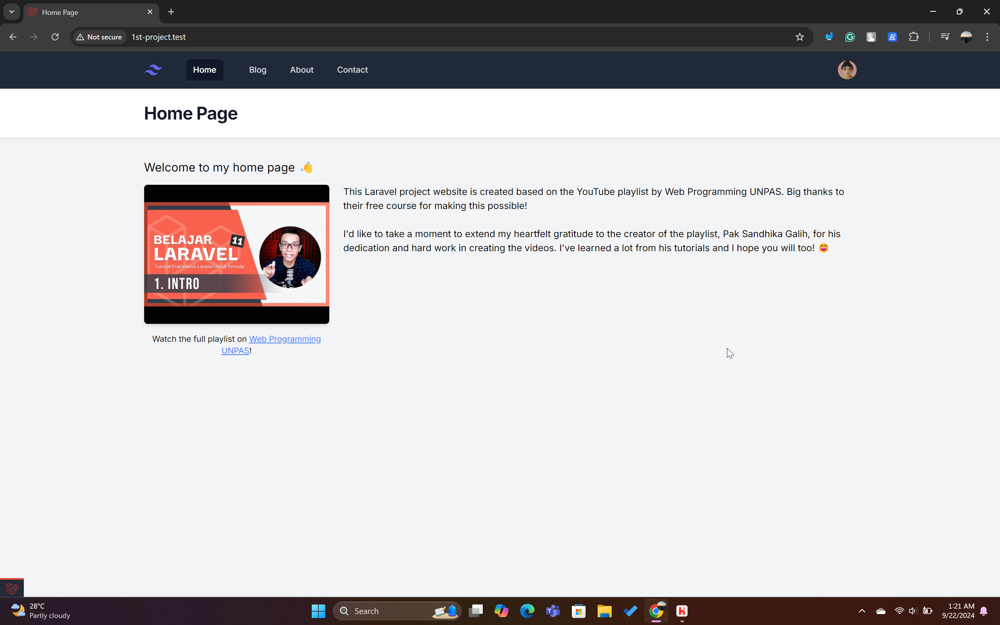  
  - Mobile:  
    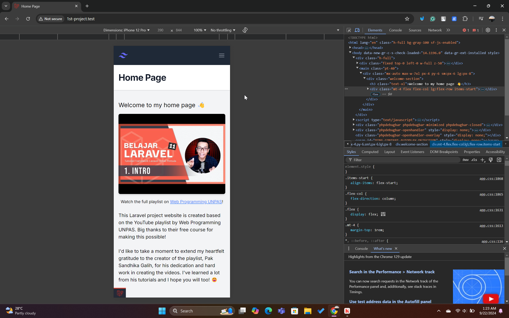
- Blog  
  - Desktop:  
    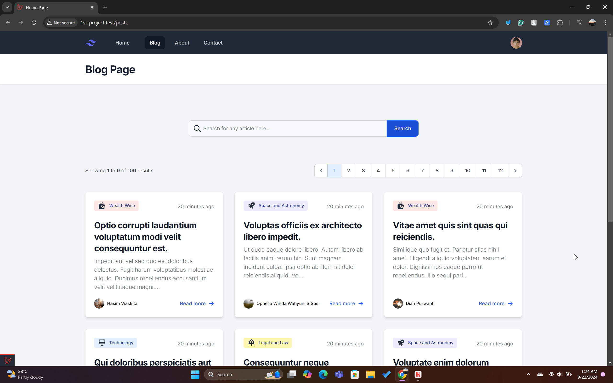  
  - Mobile:  
    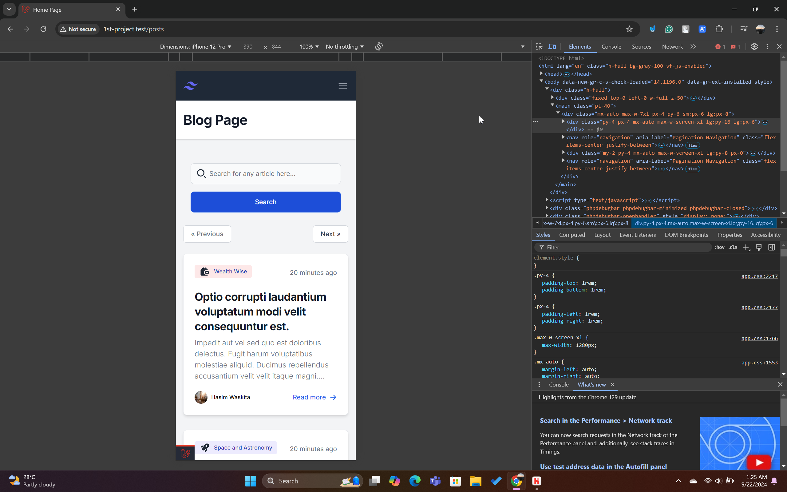
- Single Post  
  - Desktop:  
    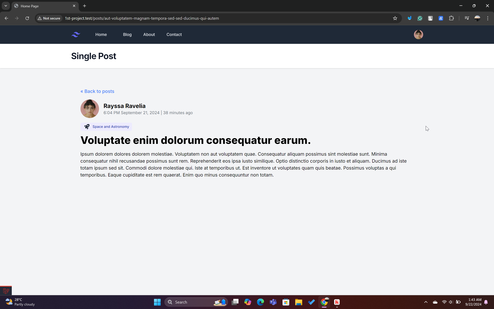  
  - Mobile:  
    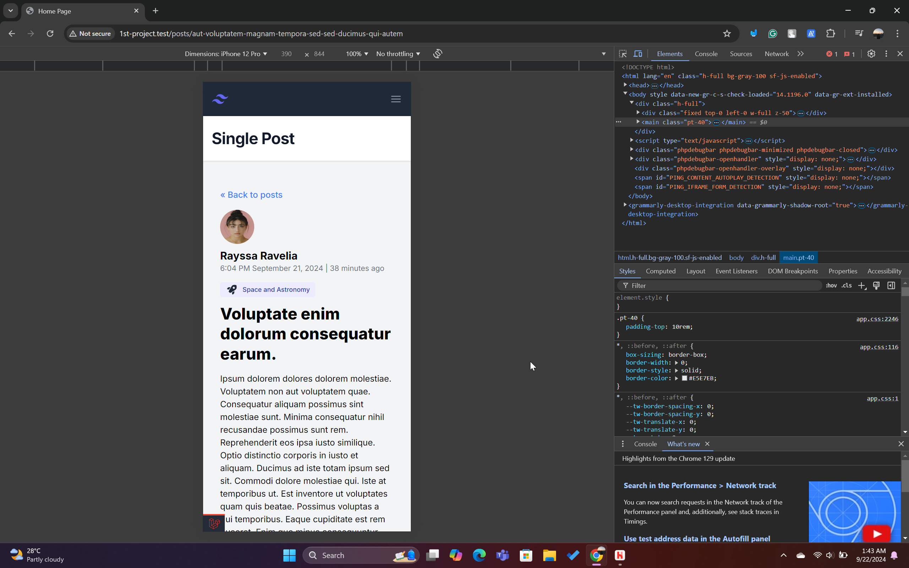
- About  
  - Desktop:  
    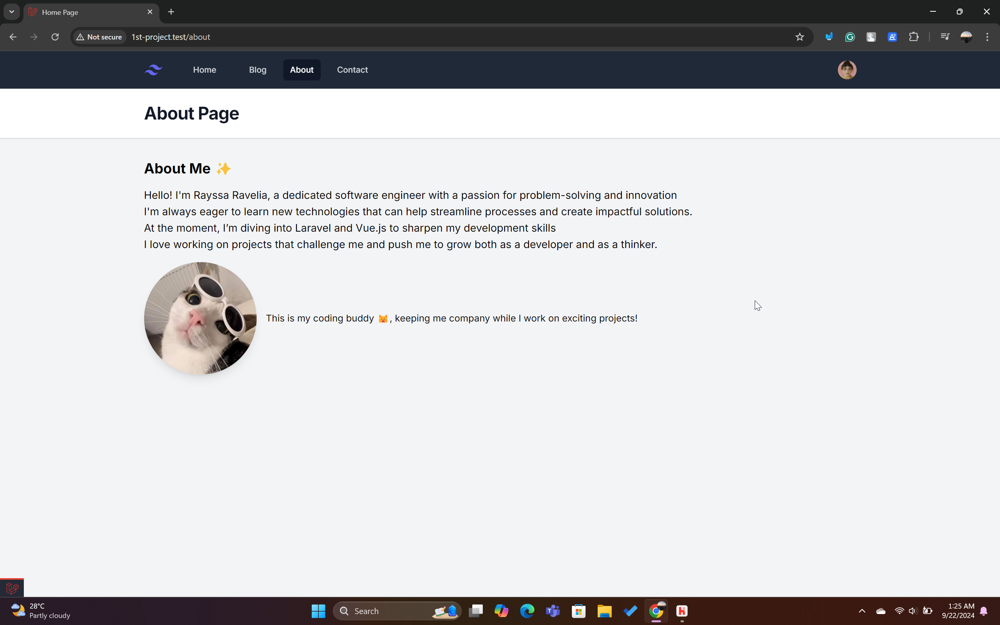  
  - Mobile:  
    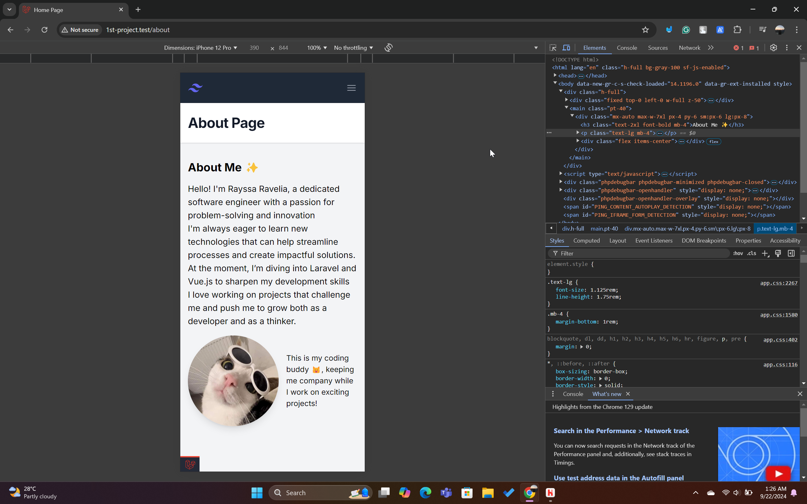
- Contact  
  - Desktop:  
    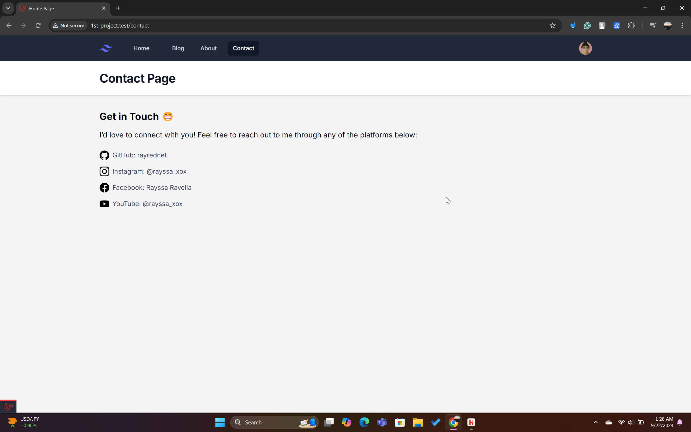  
  - Mobile:  
    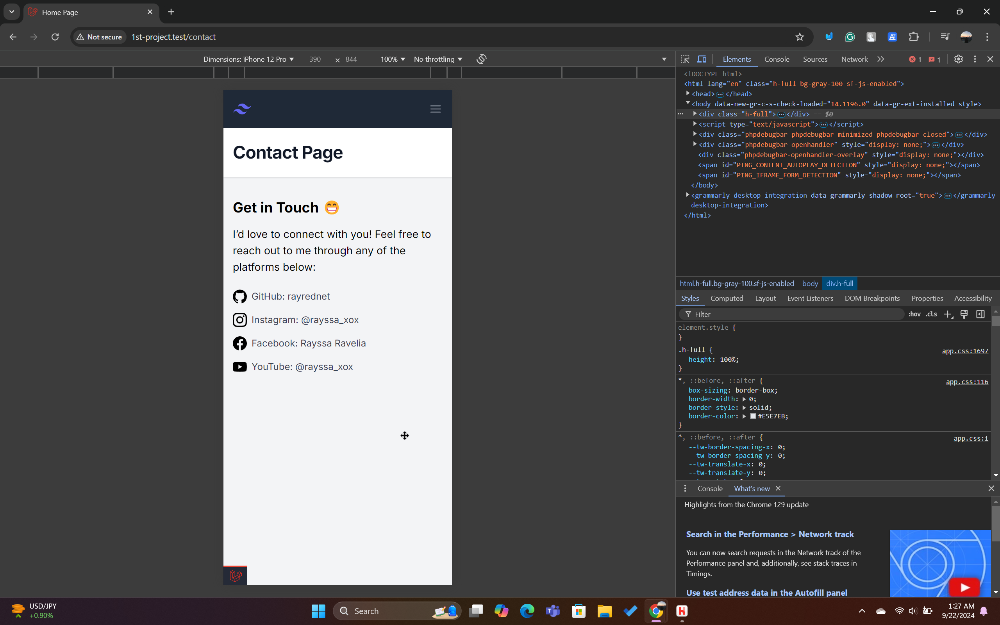

As you can see from the previous sections, the biggest changes are in the blog section only.

Now, move on to the explanation and brief details of the code changes.

### N+1 Problem
The N+1 problem occurs when the application makes multiple database queries unnecessarily. Instead of loading all data at once, it makes several separate queries, causing performance issues.

In our case, we’ve managed to solve the N+1 problem by not using lazy loading.

You can see the changes in `app/Providers/AppServiceProvider.php`:

```php
<?php

namespace App\Providers;

use Illuminate\Database\Eloquent\Model;
use Illuminate\Support\ServiceProvider;

class AppServiceProvider extends ServiceProvider
{
    public function boot(): void
    {
        Model::preventLazyLoading();
    }
}
```

**Lazy loading** defers the loading of related data until it is accessed, which can lead to excessive queries. By preventing lazy loading, we ensure that all necessary related data is retrieved in one query, reducing the number of queries significantly.

Here you can see the result in the image below, where only 7 queries are used to display the articles in the blog section:
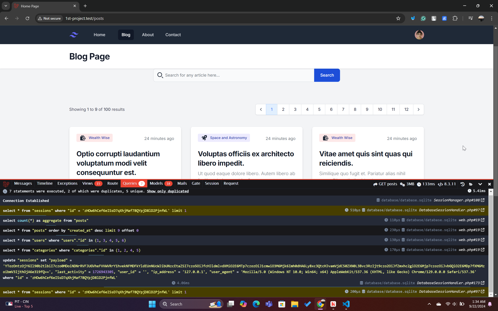

This optimization is beneficial as it reduces the overhead of multiple database queries, leading to better performance.

Another significant change is how we display the articles. We're now using cards where each card displays:
- The article category
- Time uploaded in `diffForHumans` format
- The title
- The author name
- The profile picture of the author
- A snippet of the article body  

Here’s an example of the card structure:  
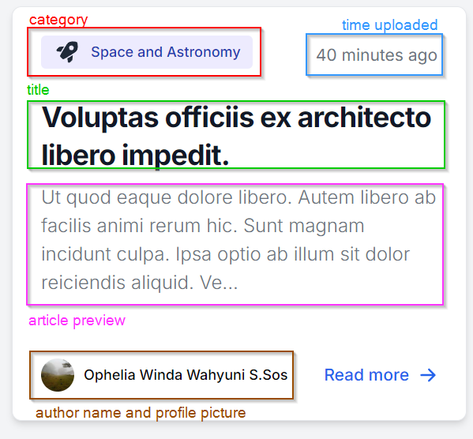

We also added a search bar that allows us to search for articles by name, and we can filter based on the author name and category.

#### Scenario Examples

1. **Filter by Category**  
   If you click on the "Legal and Law" category, all articles from the "Legal and Law" category will be displayed:  
   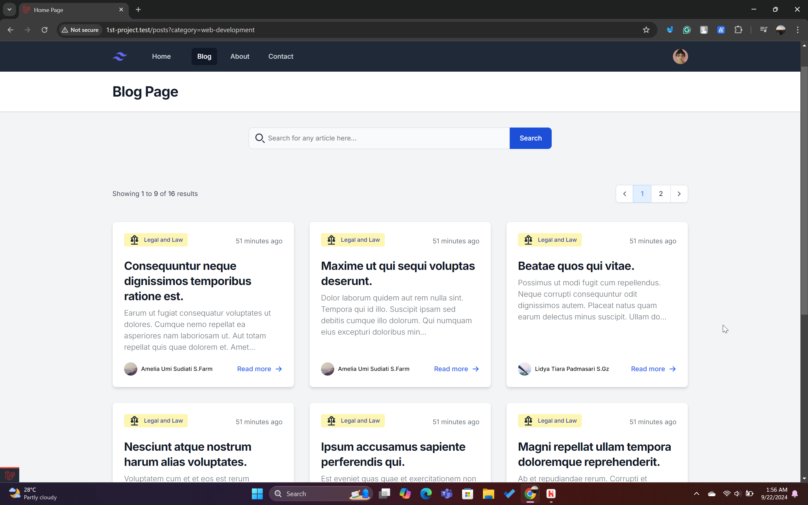  
   In the image above, there are 16 results under this category.

2. **Filter by Author**  
   If you click on "Hasim Waskita," all articles authored by Hasim Waskita will be shown:  
   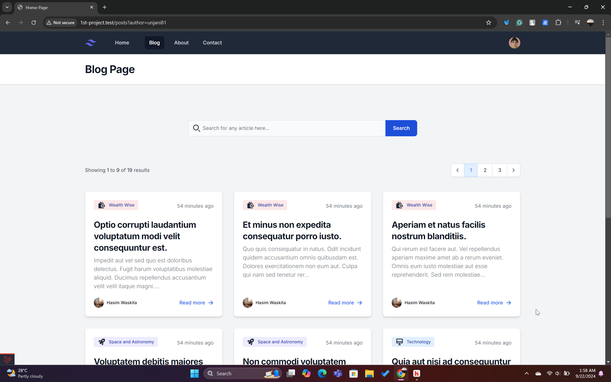  
   There are 19 results from Hasim Waskita, spanning various categories but all under his name.

3. **Filter by Category and Search by Article Name**  
   For example, after selecting the "Space and Astronomy" category, searching for the article "Et in amet maxime dolores delectus consequatur ullam." will display only one result:  
   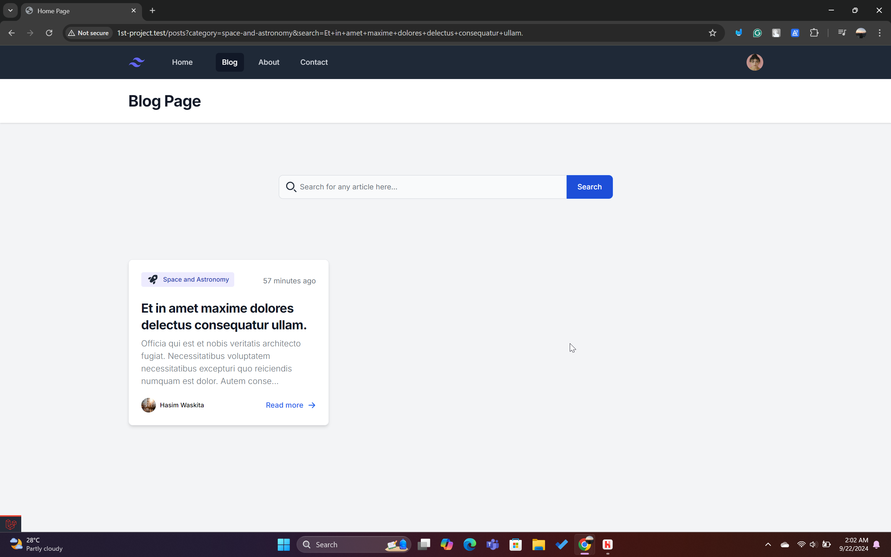  
   The URL will reflect both filters: `http://1st-project.test/posts?category=space-and-astronomy&search=Et+in+amet+maxime+dolores+delectus+consequatur+ullam`.

4. **Filter by Author and Search by Article Name**  
   Clicking on "Diah Purwanti" and searching for the article "Quia et aliquam error culpa." will give the following result:  
   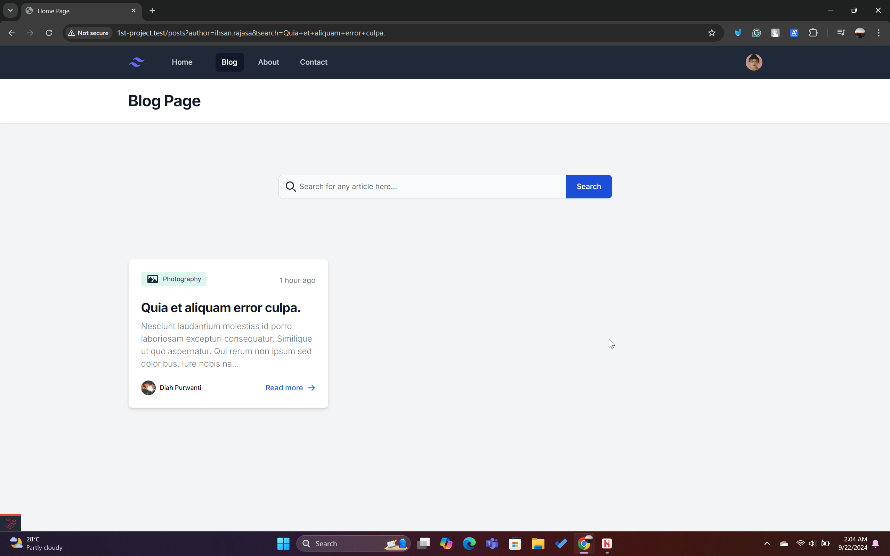  
   The URL is: `http://1st-project.test/posts?author=ihsan.rajasa&search=Quia+et+aliquam+error+culpa`.

5. **Mismatched Category and Article Name**  
   If you click on the "Technology" category and search for "Consequuntur neque dignissimos temporibus ratione est." (available under the "Legal and Law" category), no results will be displayed:  
   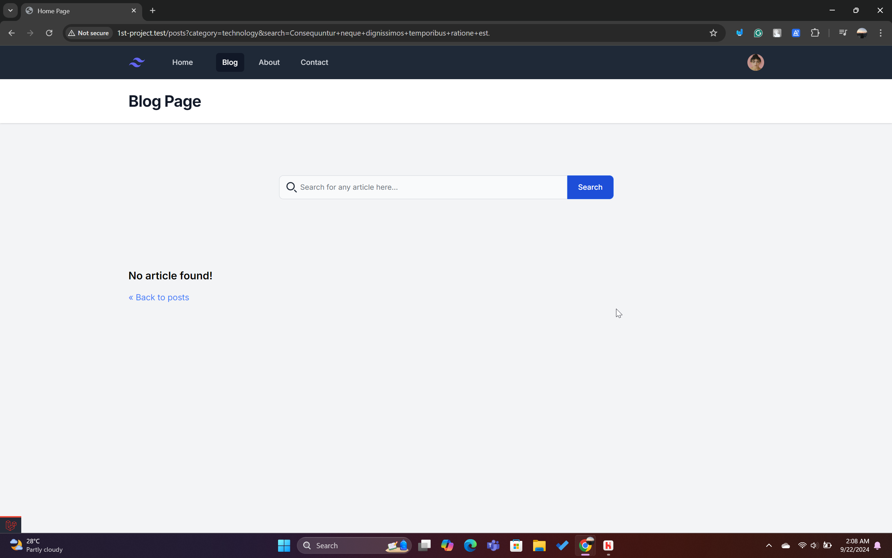  
   The URL is: `http://1st-project.test/posts?category=technology&search=Consequuntur+neque+dignissimos+temporibus+ratione+est`.

6. **Mismatched Author and Article Name**  
   If you click on "Amelia Umi Sudiati S.Farm" and search for "Qui doloribus perspiciatis aut nisi." (written by "Ophelia Winda Wahyuni S.Sos"), no results will be shown:  
     
   The URL is: `http://1st-project.test/posts?author=emin91&search=Qui+doloribus+perspiciatis+aut+nisi`.

---

Another change is the pagination. I’ve split it into 9 articles per page.

You can see the routes configuration in `routes/web.php`:

```php
<?php

use App\Models\Category;
use App\Models\Post;
use App\Models\User;
use Illuminate\Support\Facades\Route;

Route::get('/posts', function () {
    return view('posts', [
        'title' => 'Blog Page',
        'posts' => Post::filter(request(['search', 'category', 'author']))
            ->latest()
            ->paginate(9)
            ->withQueryString(),
    ]);
});
```

The `paginate(9)` ensures that only 9 posts are displayed on each page.

### Model Changes

I also made some changes to the models to add unique attributes such as category colors, category icons, and profile pictures for authors. Here are the migrations for `categories` and `users`:

#### Categories Migration
```php
Schema::create('categories', function (Blueprint $table) {
    $table->id();
    $table->string('name');
    $table->string('slug')->unique();
    $table->string('color');
    $table->string('icon');
    $table->timestamps();
});
```

#### Users Migration
```php
Schema::create('users', function (Blueprint $table) {
    $table->id();
    $table->string('name');
    $table->string('username')->unique();
    $table->string('email')->unique();
    $table->string('profile_picture');
    $table->timestamps();
});
```

### Seeder Configuration

We also updated the seeders for `users` and `categories`. The `UserSeeder` assigns unique profile pictures, and the `CategorySeeder` assigns colors and icons for each category.

#### User Seeder
```php
User::create([
    'name' => 'Rayssa Ravelia',
    'username' => 'rayssaravelia',
    'email' => 'rayssaravelia@gmail.com',
    'profile_picture' => 'https://example.com/picture.jpg',
]);
```

#### Category Seeder
```php
Category::create([
    'name' => 'Wealth Wise',
    'slug' => 'career',
    'color' => 'red',
    'icon' => '<svg>...</svg>',
]);
```

### Tailwind Configuration

In `tailwind.config.js`, I’ve added a **safelist** for the category colors to dynamically apply background colors based on the category:

```js
safelist: [
  'bg-red-100',
  'bg-green-100',
  'bg-yellow-100',
  'bg-blue-100',
  'bg-purple-100',
]
```

The colors are called like this in the view:

```html
<span class="bg-{{ $post->category->color }}-100 text-primary-800">
    {!! $post->category->icon !!}
    <span class="ml-2">{{ $post->category->name }}</span>
</span>
```

This dynamically renders the category’s color, name, and icon based on the post’s category.

---

### Summary

In this section, we addressed several performance and UI improvements:
- Solved the N+1 problem by disabling lazy loading.
- Redesigned the blog UI with cards.
- Implemented searching by article, author, and category.
- Added pagination (9 posts per page).
- Configured unique colors and icons for each category.

Thank you for following along, and I hope you find this tutorial helpful! 😁